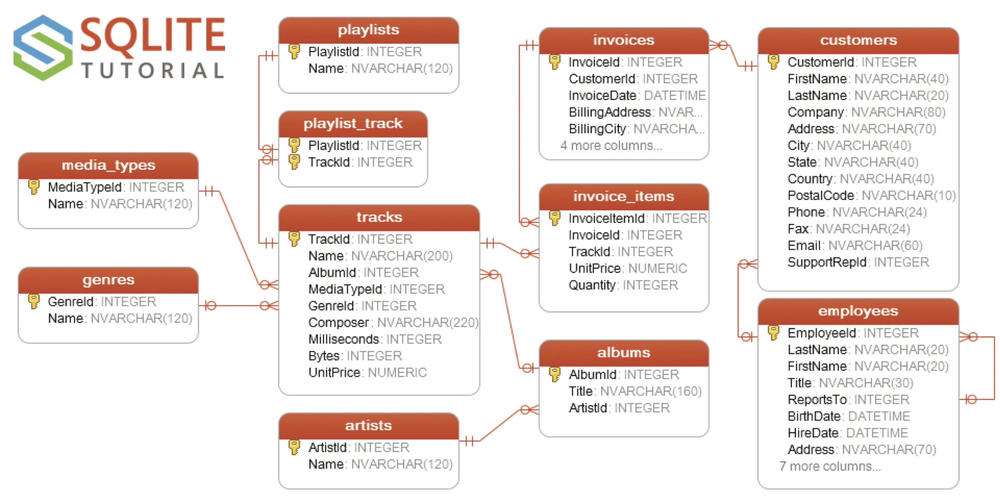

# DigitalMediaStore-RESTful

Servicio RESTful para enseñanza-aprendizaje de una API REST utilizando el framework [flask-smorest](https://flask-smorest.readthedocs.io/en/latest/). Basado en el ejemplo de [@lafrech](https://github.com/lafrech) disponible en el repositorio [flask-smorest-sqlalchemy-example](https://github.com/lafrech/flask-smorest-sqlalchemy-example).

## Paquetes necesarios

- [Flask](https://flask.palletsprojects.com/)
- [flask-smorest](https://flask-smorest.readthedocs.io/)
- [Flask-CORS](https://flask-cors.readthedocs.io/)
- [Flask-JWT-Extended](https://flask-jwt-extended.readthedocs.io/)
- [Flask-SQLAlchemy](https://flask-sqlalchemy.palletsprojects.com/)
- [Flask-Marshmallow](https://flask-marshmallow.readthedocs.io/)
- [marshmallow-sqlalchemy](https://marshmallow-sqlalchemy.readthedocs.io/)

## Base de datos de ejemplo

La base de datos utilizada es **Chinook**, que modela una tienda de música digital y está disponible para varios SGBD.



Los scripts de creación del esquema están disponibles en el repositorio [Chinook Database de Luis Rocha en Github](https://github.com/lerocha/chinook-database).

## Entorno de desarrollo local

El proyecto se ha probado con Python 3.8 y la herramienta [Pipenv](https://pipenv.pypa.io/en/latest/) para la gestión de paquetes y entornos virtuales.

```bash
$ pip install --user pipenv
```

Después de instalar el paquete Pipenv tal vez sea necesario ajustar la variable de entorno `$PATH`.

El mismo comando de instalación de dependencias creará el entorno virtual.

```bash
$ pipenv install
```

Para activar el entorno virtual del proyecto se ejecutará `pipenv shell`.

## Ejecución de la aplicación

Para la configurar la aplicación se necesitan algunas variables de entorno. Puedes encontrar un ejemplo en el fichero `.env.example`.

La variable de entorno `$FLASK_APP` indica el fichero que actuará como punto de entrada para poder lanzar la aplicación. La variable de entorno `$FLASK_ENV` indica el entorno en el que se ejecutará la aplicación (desarrollo o producción). Una vez definidas estas variables se lanza el servidor WSGI con el comando

```bash
$ flask run
```

Si no tienes el comando `flask` disponible, puedes ejecutarlo como un módulo Python.

```bash
$ python -m flask run
```
